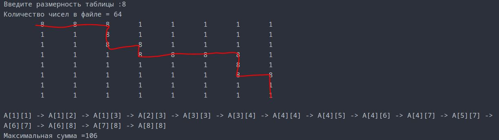

В таблице размером (N x N), где N <=20, клетки заполнены цифрами случайным образом. 
Найти маршрут из клетки (1,1) в клетку (N,N), удовлетворяющий следующим условиям:
+ любые две последовательные клетки в маршруте имеют общую сторону;
+ количество клеток маршрута минимально;
+ сумма цифр в клетках маршрута максимальна.

Матрица записана в файл Text.txt

